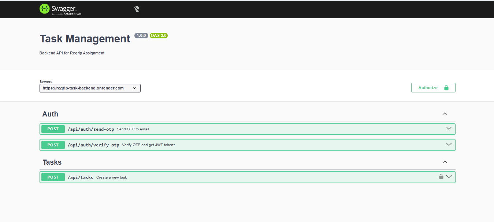

# 🚀 Task Management Backend API

A secure, production-ready REST API built using Node.js, Express, MySQL, and JWT authentication.  
This backend demonstrates OTP-based authentication, protected CRUD operations, rate limiting, and production deployment.

---

# 🌐 Live Deployment

**Base URL:**  
https://regrip-task-backend.onrender.com  

**Swagger Documentation:**  
https://regrip-task-backend.onrender.com/api-docs  

---

# 🏗️ Tech Stack

- Node.js
- Express.js
- MySQL (Railway Cloud Database)
- JWT (Access + Refresh Tokens)
- Express Rate Limit
- Swagger (OpenAPI 3.0)
- Render (Deployment)
- Railway (Cloud Database)

---

# 📂 Project Structure

```
regrip-task-backend/
│
├── src/
│   ├── config/
│   │   ├── db.js
│   │   └── swagger.js
│   │
│   ├── controllers/
│   │   ├── authController.js
│   │   └── taskController.js
│   │
│   ├── middlewares/
│   │   ├── authMiddleware.js
│   │   ├── errorHandler.js
│   │   └── rateLimiter.js
│   │
│   ├── routes/
│   │   ├── authRoutes.js
│   │   └── taskRoutes.js
│   │
│   └── utils/
│       ├── generateOtp.js
│       └── sendEmail.js
│
├── .env.example
├── package.json
├── server.js
└── README.md
```

---

# 🔐 Authentication Flow

This system uses **OTP-based passwordless authentication**.

### Step 1 — Send OTP
`POST /api/auth/send-otp`

```json
{
  "email": "user@example.com"
}
```

### Step 2 — Verify OTP
`POST /api/auth/verify-otp`

```json
{
  "email": "user@example.com",
  "otp": "123456"
}
```

Response:

```json
{
  "accessToken": "...",
  "refreshToken": "..."
}
```

---

# 📌 API Endpoints

## 🔐 Authentication

| Method | Endpoint | Description |
|--------|----------|-------------|
| POST | `/api/auth/send-otp` | Generate OTP |
| POST | `/api/auth/verify-otp` | Verify OTP & issue JWT |
| POST | `/api/auth/refresh-token` | Generate new access token |

---

## 📋 Task Management (Protected Routes)

| Method | Endpoint | Description |
|--------|----------|-------------|
| POST | `/api/tasks` | Create new task |
| GET | `/api/tasks` | Get user tasks |
| PUT | `/api/tasks/:id` | Update task |
| DELETE | `/api/tasks/:id` | Delete task |

All task routes require:

```
Authorization: Bearer <access_token>
```

---

# 🛡️ Security Features

- OTP expiry (5 minutes)
- OTP attempt limitation
- API rate limiting
- Short-lived JWT (15 min)
- Refresh token support
- Strict ownership validation
- Global error handling
- Cloud proxy configuration

---

# 🗄️ Database Schema

### Tables Used:

- users
- otps
- tasks
- activity_logs

Each task is linked to a user via foreign key constraint.

---

# 📬 OTP Delivery Strategy

### Local Development
OTP is delivered using Gmail SMTP via App Password.

### Production (Render Free Tier)
Render free tier restricts outbound SMTP connections.  
Due to this, direct Gmail SMTP may not function in production.

However:
- OTP generation works
- OTP storage works
- OTP verification works
- Authentication flow works correctly

This ensures secure authentication logic remains intact in cloud deployment.

---

# ⚙️ Environment Variables

Create `.env` file locally:

```
PORT=5000
DB_HOST=
DB_PORT=
DB_USER=
DB_PASSWORD=
DB_NAME=
JWT_SECRET=
JWT_REFRESH_SECRET=
EMAIL_USER=
EMAIL_PASS=
```

---

# 🧪 Running Locally

```
npm install
npm run dev
```

Server runs on:
```
http://localhost:5000
```

---

# 📊 Swagger Documentation

Swagger UI available at:

```
/api-docs
```

---

## 📷 Swagger Screenshot

(Add screenshot here)

Example:

```

```

---


# 🚀 Deployment

- Backend hosted on Render (Free Tier)
- Database hosted on Railway MySQL
- Environment variables configured in Render dashboard
- SSL-enabled MySQL connection

---

# 🧠 Design Decisions

- Passwordless authentication improves usability
- Short-lived JWT reduces token misuse risk
- Refresh tokens maintain session continuity
- Rate limiting prevents brute-force attacks
- Environment-based configuration supports cloud deployment

---

# 👨‍💻 Developed By

Backend Engineering Assignment Submission
